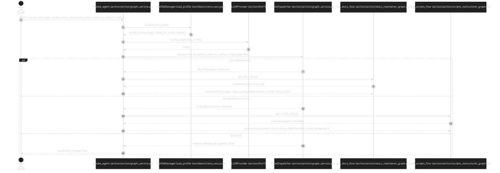

# Archon Specialized Agent Flows

This document shows three Mermaid sequence diagrams:
- Request→Profile→Dispatch overview
- DocsMaintainer full flow (Part 1 → Gate → Part 2)
- ScriptsRestructurer full flow (Part 1 → Gate → Part 2)

All flows are profile-driven (models are selected only via profiles) and approval-gated.

---

## Request → Profile → Dispatch (who receives what)



---

## DocsMaintainer — Full Flow (Part 1 → Gate → Part 2)

```mermaid
%%{init: {"theme": "dark", "sequence": {"showSequenceNumbers": true}, "themeVariables": {"fontSize": "18px", "fontFamily": "Inter, Arial"}} }%%
sequenceDiagram
    autonumber
    actor Client as Caller
    participant API as invoke_agent (archon/archon/graph_service.py)
    participant Flow as DocsFlow (archon/archon/docs_maintainer_graph.py)
    participant Graph as LangGraph StateGraph
    participant Ensure as ensure_dirs (archon/archon/restruct_common/ensure_dirs.py)
    participant Inv as inventory_and_heads (archon/archon/docs_nodes/inventory.py)
    participant Links as link_check_internal (archon/archon/docs_nodes/links.py)
    participant Taxo as diataxis_classify (archon/archon/docs_nodes/taxonomy.py)
    participant FM as frontmatter_plan (archon/archon/docs_nodes/frontmatter.py)
    participant Struct as structure_toc_proposals (archon/archon/docs_nodes/structure.py)
    participant Brief as assistant_brief (archon/archon/docs_nodes/report.py)
    participant Gate as await_approval (archon/archon/restruct_common/approval.py)
    participant ApplyMv as apply_moves_git_mv (archon/archon/restruct_common/git_apply.py)
    participant ApplyFM as apply_frontmatter_with_backups (archon/archon/restruct_common/backups.py + archon/archon/docs_nodes/frontmatter.py)
    participant Reval as revalidate_links_inventory (archon/archon/docs_nodes/{links.py,inventory.py})
    participant Final as final_report (archon/archon/docs_nodes/report.py)
    participant LLM as SubAgent (profile-injected via Provider)

    Client->>API: /invoke {profile_name: "DocsMaintainer", requested_action, approval_token?}
    API->>Flow: get_docs_flow()
    Flow-->>API: compiled graph
    API-->>Graph: astream(state0, cfg={configurable:{profile_config, thread_id}})

    Graph->>Ensure: run(state, cfg)
    Ensure-->>Graph: ensures generated/docs_reorg/ and generated/backups/docs_reorg/

    Graph->>Inv: run(state, cfg)
    Inv-->>Graph: writes inventory.json (paths, headings, frontmatter presence)

    Graph->>Links: run(state, cfg)
    Links-->>Graph: writes links_report.json (internal/relative)

    Graph->>Taxo: classify with LLM
    Taxo->>LLM: prompt diataxis_classifier (model from profile)
    LLM-->>Taxo: classes per path
    Taxo-->>Graph: writes taxonomy_map.json

    Graph->>FM: plan with LLM
    FM->>LLM: prompt frontmatter_normalizer (model from profile)
    LLM-->>FM: normalized plan
    FM-->>Graph: writes frontmatter_plan.json

    Graph->>Struct: plan with LLM
    Struct->>LLM: prompt docs_structure_planner (model from profile)
    LLM-->>Struct: move plan + ToC
    Struct-->>Graph: writes rename_move_plan.json and toc_proposals/*.yml

    Graph->>Brief: run(state, cfg)
    Brief-->>Graph: writes assistant_brief.md

    Graph->>Gate: run(state, cfg)
    alt requested_action == "part1"
      Gate-->>API: return read-only artifacts
      API-->>Client: generated/docs_reorg/*
    else approval_token missing
      Gate-->>API: needs_approval = true
      API-->>Client: provide approval_token
    else approval_token present
      Gate-->>Graph: continue
    end

    Graph->>ApplyMv: run(state, cfg)
    ApplyMv-->>Graph: git mv from plan; conflicts produce .dup; no deletes

    Graph->>ApplyFM: run(state, cfg)
    ApplyFM-->>Graph: backups under generated/backups/docs_reorg/timestamp then fm merge

    Graph->>Reval: run(state, cfg)
    Reval-->>Graph: writes apply_report.json (delta)

    Graph->>Final: run(state, cfg)
    Final-->>API: final_state with apply_summary

    API-->>Client: {artifacts, apply_summary | needs_approval | error}
```

---

## ScriptsRestructurer — Full Flow (Part 1 → Gate → Part 2)

```mermaid
%%{init: {"theme": "dark", "sequence": {"showSequenceNumbers": true}, "themeVariables": {"fontSize": "18px", "fontFamily": "Inter, Arial"}} }%%
sequenceDiagram
    autonumber
    actor Client as Caller
    participant API as invoke_agent (archon/archon/graph_service.py)
    participant Flow as ScriptsFlow (archon/archon/scripts_restructurer_graph.py)
    participant Graph as LangGraph StateGraph
    participant Ensure as ensure_dirs (archon/archon/restruct_common/ensure_dirs.py)
    participant Inv as inventory (archon/archon/scripts_nodes/inventory.py)
    participant Sem as semantic_grouping (archon/archon/scripts_nodes/semantic.py)
    participant Plan as plan (archon/archon/scripts_nodes/plan.py)
    participant Log as decision_log (archon/archon/scripts_nodes/report.py)
    participant Brief as assistant_brief (archon/archon/scripts_nodes/report.py)
    participant Gate as await_approval (archon/archon/restruct_common/approval.py)
    participant ApplyMv as apply_moves_git_mv (archon/archon/restruct_common/git_apply.py)
    participant Reval as revalidate_inventory (archon/archon/scripts_nodes/inventory.py)
    participant Final as final_report (archon/archon/scripts_nodes/report.py)
    participant LLM as SubAgent (profile-injected via Provider)

    Client->>API: /invoke {profile_name: "ScriptsRestructurer", requested_action, approval_token?}
    API->>Flow: get_scripts_flow()
    Flow-->>API: compiled graph
    API-->>Graph: astream(state0, cfg={configurable:{profile_config, thread_id}})

    Graph->>Ensure: run(state, cfg)
    Ensure-->>Graph: ensures generated/restruct/ and generated/backups/restruct/

    Graph->>Inv: run(state, cfg)
    Inv-->>Graph: writes global_inventory.json (ext, size, path)

    Graph->>Sem: analyze with LLM
    Sem->>LLM: prompt scripts_semantic_grouping (model from profile)
    LLM-->>Sem: clusters (cli, utils, ops, dev, tests, docs)
    Sem-->>Graph: writes content_insights_root.json

    Graph->>Plan: plan with LLM
    Plan->>LLM: prompt scripts_move_planner (model from profile)
    LLM-->>Plan: source to target mapping + rationale
    Plan-->>Graph: writes rename_move_plan.json

    Graph->>Log: run(state, cfg)
    Log-->>Graph: writes semantic_review_root.md

    Graph->>Brief: run(state, cfg)
    Brief-->>Graph: writes assistant_brief.md

    Graph->>Gate: run(state, cfg)
    alt requested_action == "part1"
      Gate-->>API: return read-only artifacts
      API-->>Client: generated/restruct/*
    else approval_token missing
      Gate-->>API: needs_approval = true
      API-->>Client: provide approval_token
    else approval_token present
      Gate-->>Graph: continue
    end

    Graph->>ApplyMv: run(state, cfg)
    ApplyMv-->>Graph: git mv from plan; conflicts produce .dup; no deletes

    Graph->>Reval: run(state, cfg)
    Reval-->>Graph: writes apply_report.json (delta)

    Graph->>Final: run(state, cfg)
    Final-->>API: final_state with apply_summary

    API-->>Client: {artifacts, apply_summary | needs_approval | error}
```
